# SDA Overall Architecture


- Nertwork Fabric / Campus Fabric which show the real advantage and value.
- Cisco SDA is the newer version of Cisco Campus Fabric.
- Benefits of SDA
  - L2 Loop free topology ; as fabric runs on the top of routed network.
  - Since the Fabric runs all the way upto the "Access" there is no need for spanning tree.
  - The device can virtual be at any place in the network . Movability


**Fabric Edge Nodes** These are the switches where the endpoints are connected.

  - L3 Switch maintains the virtual network information.
  - It detect the endpoints and notfies the control plane about it.
  - It also is responsible for VXlAN Encap and Decap


**Fabric Control Plane Nodes** Its like the brain of the system.

  - Serves as central DB for all endoint ont he fabric
  - Provides Endpopit Location mapping to edge and border noeds
  - Help them route packet from one node to another using LISP as the ctornol Plan t
  - It is basically a LISP MAP Server and MAP Resolver
  - It is not in the Data Path.


**Fabric Border Nodes** This for the L3 connnectivity for your network.

  - The L3 connectivty to external systems to learn external routes into the fabric and vice versa.
  - Any external routes are regsiteres with the control plane ; which acts as a central point for redirector for edge nodes to talk to the border.
  - It also translates traffic from Fabric (South) and Non Fabric Traffic.
  - There are two types of Border Nodes:
      - 1. Deals with Known Routes : Enterprise Subnets
      - 2. Deals with Unknow Routes: Default Border , used as a last resort when there is no match and is mostly internet bound.

  - Both KNown and Unkow can be on same the router.

*Border and Control Plane can be joined together ; you need two nodes for redundancy*

**Internediate Nodes** Provides IP reachability for the Fabric Nodes , can be any device which provides IP connectivty. (It has to be routes and shoudl not be having STP running.)

*Hosting Border , Control and Internmediate all totger is not recommended*

**WLC** Sits outside the fabric and also talks to the Control Plane node.

**Access Point** AP no longer sends traffic to WLC , it encap decap VXLAN for the fabric and mainatain control plane connection with WLC for CAPWAP.
AP should be directly connected to Edge Node.


**DNA C** DNA C is used to manage and deploy config in the SD Access networks. It integrates with ISE and IPAM (IP Managment) servers.
*3 DNA-C in a cluster is recommended*

DNA Cetner consistes of APIC-EM and NDP (Assurance , Network Data Platform)

*ISE is managed separately than DNA-C*

*Stealthwatch addons to provide Encrypted Traffic Analytics*

# Hardware Component


*Review the DNA Center Installation Guide for cabling and port information*

It has at the following ports :

`Cluster Port` : Cluster communication with other DNA Cerner nodes.
`Enterprise Port` : The purpose of this port is to enable Cisco DNA Center to communicate with and manage your network. Connect this port to a switch with connections to the enterprise network and configure one IP address with subnet mask for the port.
`Coud Port `: This port, labeled 2 on the rear panel, is optional. Use it only if you cannot connect the appliance to the Internet (including to your Internet proxy server) using the 10-Gbps enterprise port (enp94s0f0/enp69s0f0, Network Adapter 3). If you need to use the cloud port, connect it to a switch with connections to your Internet proxy server and configure one IP address with subnet mask for the port.
`Managemetn Port` :  This port (labeled 1 on the rear panel) provides access to the Cisco DNA Center GUI, allowing users to use the software on the appliance. Connect this port to a switch with connections to your enterprise management network, and configure one IP address with a subnet mask for the port.

# Suported Device


https://www.cisco.com/c/en/us/support/cloud-systems-management/dna-center/products-device-support-tables-list.html

## Edge Border Control Capability ?


# Traffic Flow in SDA (Wired)

The pic below shows the basic VTEPs and VXLAN exncap decap locations in the Fabric. The packet is decapsulated and matched to the local VNI matching and sent on it.


`Scenraio 1` : **Stays within the Fabric** , VTEP asks Control Plane on where the destination is , encapsulates into VXLAN and sends to other VTEP

`Scenraio 2` : **Stays within the Fabric BUT differen Virtual Network** , Currently the Packet needs to go out to the R1 (Which is the Fusion Router) . It sits outside the fabirc and connects to the Border. it has multiple sub interface one per VN.
(VN as the user networks)
BGP is used to advertise the routes from the Border Nodes to teh Fusion Router.

*Ofcourse this is not optimal , but this the solution we have today*

`Scenario 3a`: **Packet routed outside to the Fabric to KNOWN** network. Once again VTEP asks for the location , Control plane responds with the address of the "Regular" border node.

`Scenario 3b `: **Packet routed outside to the Fabric to UN-KNOWN** network. Once again VTEP asks for the location , Control plane responds with the address of the "DEFAULT" border node.


For a source VTEP to know where the destination is , a Control Plane is needed (ip device trackign and LISP help with this)

DNAC enables device trackign on the switches it provisions.


**Just like the edge node register the endpoints with Contro Node , Border Nodes register route prefixes with the Controle node**

Something like :

```
192.168.1.0/24 is reachable via BORDER1
```

Just like ACI it has **Anycast GWs** for SVIs shared across all nodes , These SVIs are same across all devices and also has the same MAC address (so device roaming is not a problem):


# Traffic Flow in SDA (Wireless)

- WLC talks to the controller (SDA) using LISP
- WLC tells the wireless endpoitns coming on the network and notifyies this to the SDA Control Plane.
- Local Mode AP connects to the edge switch and SSID is fabric mode enabled.

*AP in Fabric Mode support VXLAN*

*There is a mini VXLAN Tunnel between the edge switch and the AP*


# DNA Center Installation

### Login to CIMC and Verify the guidance provided on the isntall guide

https://www.cisco.com/c/en/us/td/docs/cloud-systems-management/network-automation-and-management/dna-center/1-3-3-0/install_guide/2ndGen/b_cisco_dna_center_install_guide_1_3_3_0_2ndGen/b_cisco_dna_center_install_guide_1_3_2_0_M5_chapter_011.html


### Mount the DNA Cetner ISO and Install

1. *Start the installation*
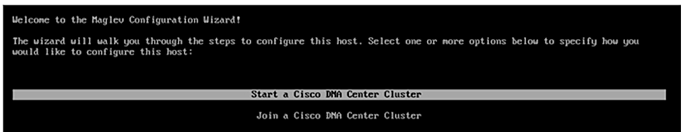
2. *Define the IP Addresses for Data and Cluster Links*
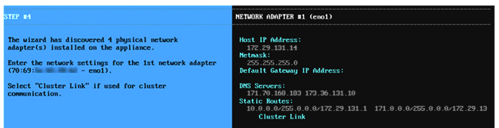
*Cluster Virtual IP is same and shared across all the DNA-Cs*
3. *Configre the Optional Link*
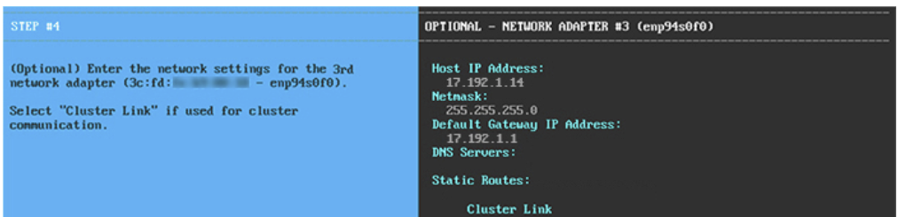
4. *Set the Admin Accounts*

5. *Username to login to the console is `maglev`*
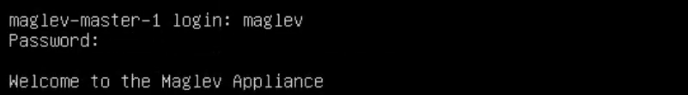
6. *Setup CCO Account - for SmartLicensing*

7. *Provide the details of IP Address management - Infoblox and Bluecat are the supported vendors*
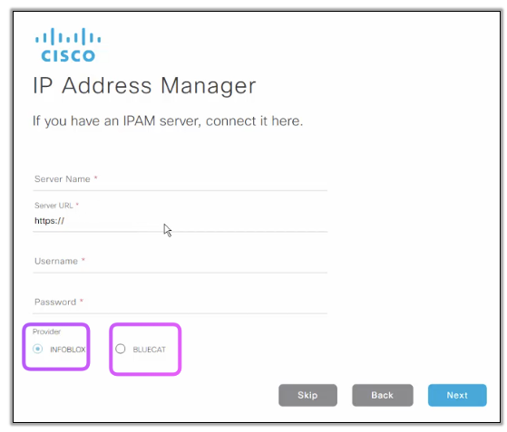

### Initial navigating around in DNAC

1. *Below shows the number of services running when the DNAC is up , should be a good number to tally when something is worng , the same section below also lists additional DNA Applicances if there are any*
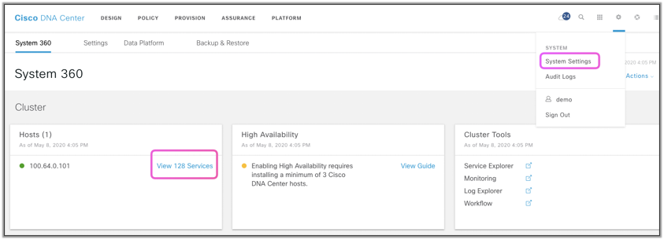
2. *What each section does is colored below*
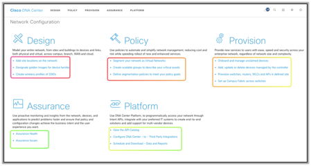

## Design Section (GUI Introduction)

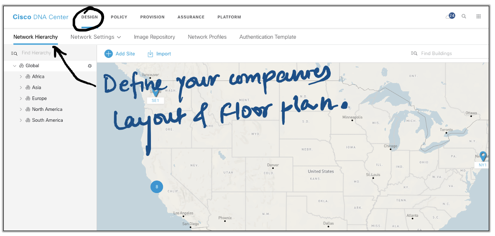

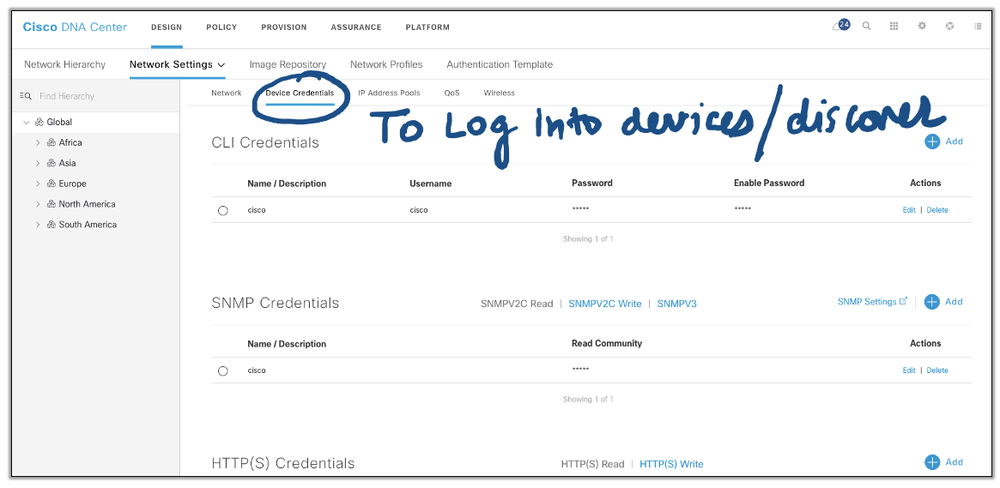
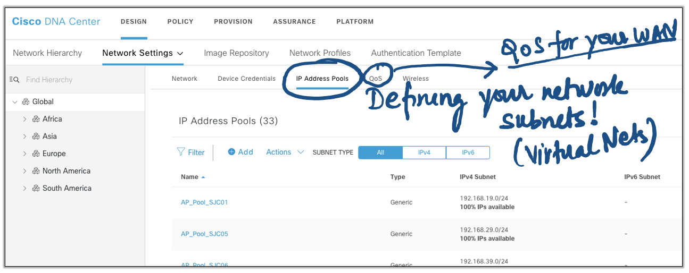
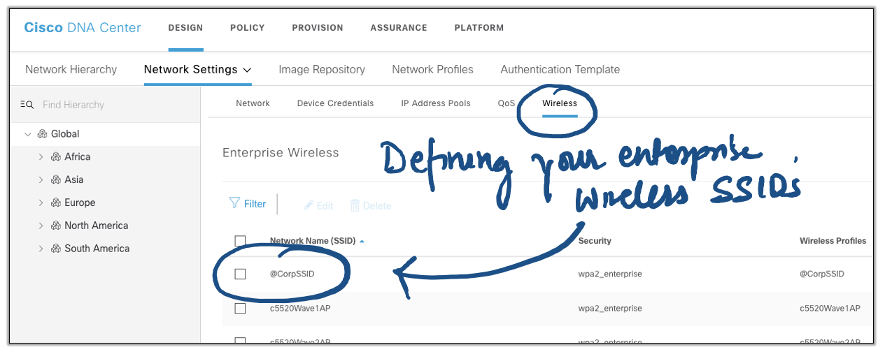

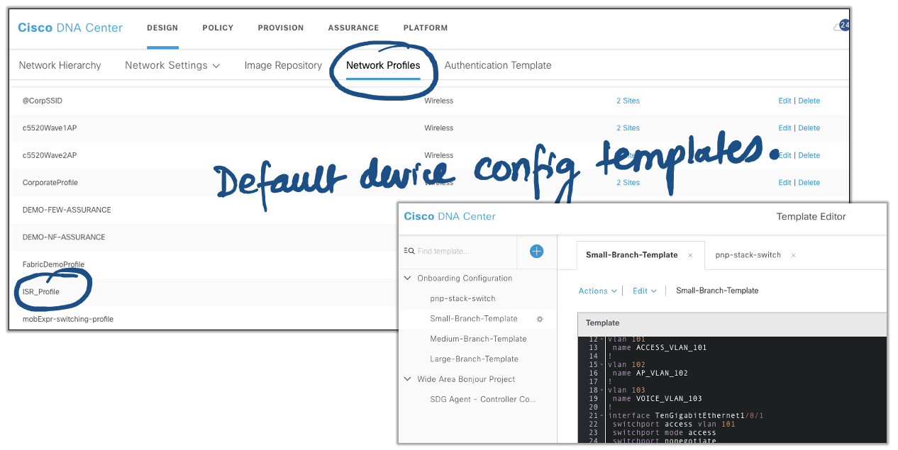
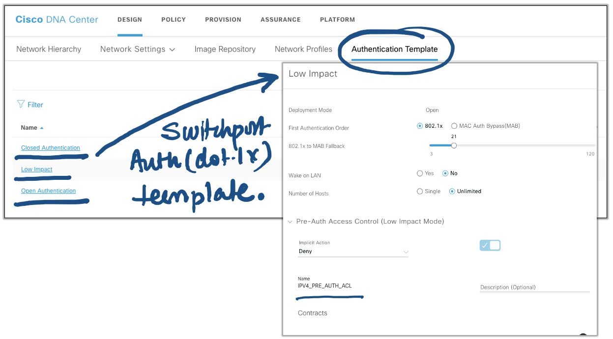
