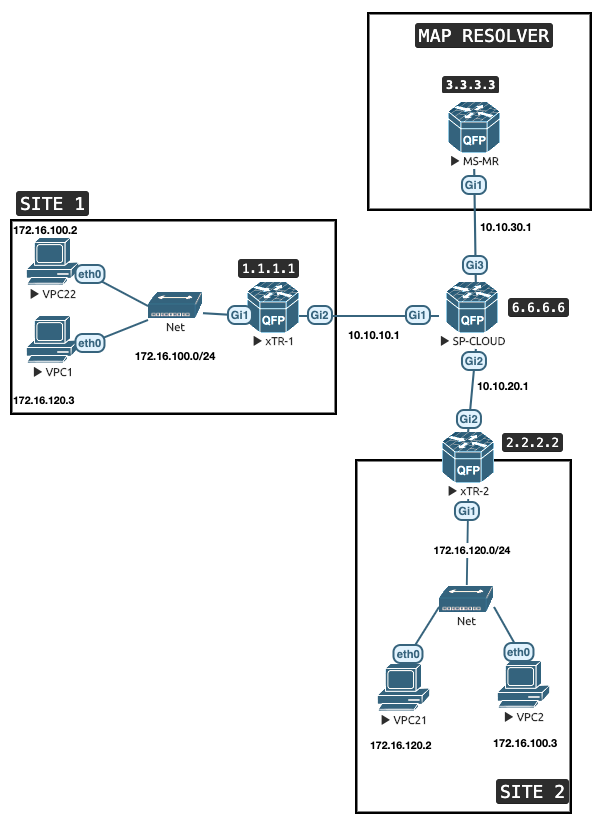
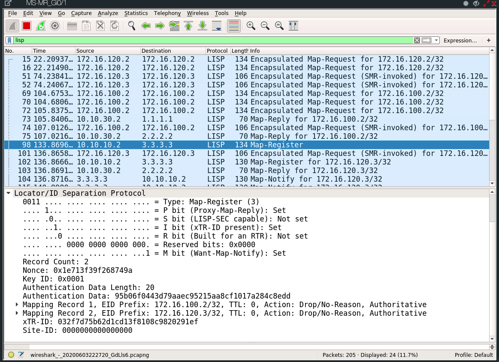

This is a post to get y ou started with the LISP protocol quick, This is a good primer for SD Access.


# Introduction

LISP is an Overlay Routing Architecture , which separates the endpoint identity from its location.

LISP is very analogous to a DNS system. 


Locator ID Separation Protocols  which separated the endpoint ID from its location.

## LISP Components 
*LISP has 3 main components* :

- **The Egress and Ingress Tunnel Routers also known as `ETR or ITR`** : Does the encapsulation and decapsulation of LISP packets. There are Egress and Ingress Tunnel Routesr (ETR and ITR). When both the functions can be merged into one is called **`XTR`**.


- **MAP Server and MAP Resolver `MR` and `MS`** : The DNS type name resolution system for LISP.
  - The **MAP Resolver (MR)** receivers MAP-REQUESTS from ITRs and forwards them to the mapping system. 

  - The **MAP Server (MS)** Advertises EID (Endpoint ID) inot the LISP mapping system for ETRs that register to it. 

- **Proxy Engress/Ingress Tunnel Router or `PXTR`** : Acts as the border between LISP and Non LISP networks. Not used in the example here though. 




### Step 1. Start the Config with MAP Server/ Resolver `MS-MR` This is the heart of the system.


```shell
hostname xTR-1

router lisp
 # We define sites and the prefixes 
 # which will be reachable via that site.
 site campus
  authentication-key cisco
  # You can create multiple sites for each 
  # prefixes but here we will us just one campus.
  eid-prefix 172.16.100.0/24 accept-more-specifics
  eid-prefix 172.16.120.0/24 accept-more-specifics
  eid-prefix 172.16.130.0/24 accept-more-specifics
  eid-prefix 172.16.140.0/24 accept-more-specifics
  exit
 !
 # Finally enable the services
 ipv4 map-server
 ipv4 map-resolver
 exit
!
```

```shell
# This gives you details about the site we 
# created above. Notice none of the 
# prefixes are up or registered.
show lisp site
!

# Notice that these are not up and not registered yet.
```

### Step 2. Next we configure one of the site routers . Configure the xTR-1

```shell
!
router lisp
 # Used when there are muliple ETRs at a site and this can be used for grouping or redundancy puposes.
 locator-set site-1
  # define the source interface that will be used for LISP 
  # The weights and priorotu are again used when there are multiple routers.
  ipv4-interface Loopback0 priority 10 weight 10
  exit
 !
 # Now we define the EID blocks that will be availiable from this site (xTR1)
 # Since we are showing LISP Mobility we will use dynamic . If it was static we could have used static. 
 # In this example all subnets are availaible on all sites
 dynamic-eid 172-16-100-0
  database-mapping 172.16.100.0/24 locator-set site-1
  exit
 !
 dynamic-eid 172-16-120-0
  database-mapping 172.16.120.0/24 locator-set site-1
  exit
 !
 dynamic-eid 172-16-130-0
  database-mapping 172.16.130.0/24 locator-set site-1
  exit
 !
 # Enable and Point to MS-MR
 ipv4 itr map-resolver 3.3.3.3
 ipv4 itr
 ipv4 etr map-server 3.3.3.3 key cisco
 ipv4 etr
 exit
!
```

```shell
!
# Enable the mobility under the needed 
# interface for the defined networks
interface GigabitEthernet1
 no shutdown
 ip address 172.16.100.1 255.255.255.0
 negotiation auto
 lisp mobility 172-16-100-0
 lisp mobility 172-16-120-0
 lisp mobility 172-16-130-0
!
```

### Step 3. Next we configure one of the site routers . Configure the xTR-2


### Verification Commands

```shell
MR-MS#show lisp site
LISP Site Registration Information
* = Some locators are down or unreachable

Site Name      Last      Up   Who Last             Inst     EID Prefix
               Register       Registered           ID
campus         never     no   --                            172.16.100.0/24
               00:00:37  yes  10.10.10.2                    172.16.100.2/32
               00:00:16  yes  10.10.20.2                    172.16.100.3/32
               never     no   --                            172.16.120.0/24
               00:00:16  yes  10.10.20.2                    172.16.120.2/32
               00:00:24  yes  10.10.10.2                    172.16.120.3/32
               never     no   --                            172.16.130.0/24
               never     no   --                            172.16.140.0/24
MR-MS#
```


```shell
xTR-1#show ip route 172.16.120.2/32 
```


```shell
xTR-1#show ip cef 172.16.120.2/32 detail
172.16.120.2/32, epoch 2, flags [subtree context, check lisp eligibility]
  SC owned,sourced: LISP remote EID - locator status bits 0x00000001
  LISP remote EID: 19 packets 1862 bytes fwd action encap, dynamic EID need encap
  SC inherited: LISP cfg dyn-EID - LISP configured dynamic-EID
  LISP EID attributes: localEID No, c-dynEID Yes, d-dynEID No
  LISP source path list
    nexthop 2.2.2.2 LISP0
  2 IPL sources [no flags]
  nexthop 2.2.2.2 LISP0
xTR-1#

```


```shell
xTR-1#show ip lisp map-cache
LISP IPv4 Mapping Cache for EID-table default (IID 0), 6 entries

0.0.0.0/0, uptime: 01:15:20, expires: never, via static send map-request
  Negative cache entry, action: send-map-request
172.16.100.0/24, uptime: 01:15:20, expires: never, via dynamic-EID, send-map-request
  Negative cache entry, action: send-map-request
172.16.100.3/32, uptime: 00:58:41, expires: 23:01:18, via map-reply, complete
  Locator  Uptime    State      Pri/Wgt
  2.2.2.2  00:58:41  up          10/10
172.16.120.0/24, uptime: 01:15:20, expires: never, via dynamic-EID, send-map-request
  Negative cache entry, action: send-map-request
172.16.120.2/32, uptime: 01:08:00, expires: 22:52:00, via map-reply, complete
  Locator  Uptime    State      Pri/Wgt
  2.2.2.2  01:08:00  up          10/10
172.16.130.0/24, uptime: 01:15:20, expires: never, via dynamic-EID, send-map-request
  Negative cache entry, action: send-map-request
xTR-1#
```


---
##        END

---


### Full Configs of all Devices


### MS-MR

```shell
!
hostname MR-MS
!
interface Loopback0
 no shutdown
 ip address 3.3.3.3 255.255.255.255
 ip ospf network point-to-point
!
interface GigabitEthernet1
 no shutdown
 ip address 10.10.30.2 255.255.255.0
 negotiation auto
!
!
router lisp
 site campus
  authentication-key cisco
  eid-prefix 172.16.100.0/24 accept-more-specifics
  eid-prefix 172.16.120.0/24 accept-more-specifics
  eid-prefix 172.16.130.0/24 accept-more-specifics
  eid-prefix 172.16.140.0/24 accept-more-specifics
  exit
 !
 ipv4 map-server
 ipv4 map-resolver
 exit
!
router ospf 10
 network 3.3.3.3 0.0.0.0 area 0
 network 10.0.0.0 0.255.255.255 area 0
!
```


### SP-CLOUD

```shell
!
hostname SP-CLOUD
!
!
interface Loopback0
 no shutdown
 ip address 6.6.6.6 255.255.255.255
 ip ospf network point-to-point
!
interface GigabitEthernet1
 no shutdown
 ip address 10.10.10.1 255.255.255.0
 negotiation auto
!
interface GigabitEthernet2
 no shutdown
 ip address 10.10.20.1 255.255.255.0
 negotiation auto
!
interface GigabitEthernet3
 no shutdown
 ip address 10.10.30.1 255.255.255.0
 negotiation auto
!
!
router ospf 10
 network 0.0.0.0 255.255.255.255 area 0
!
```


### Config for xTR-1
```shell
!
! Last configuration change at 14:00:56 UTC Mon May 28 2018
!
version 15.6
service timestamps debug datetime msec
service timestamps log datetime msec
no platform punt-keepalive disable-kernel-core
platform console serial
!
hostname xTR-1
!
boot-start-marker
boot-end-marker
!
!
!
no aaa new-model
!
!
!
!
!
!
!
!
!


!
!
!
!
!
!
!
!
!
!
subscriber templating
!
!
!
multilink bundle-name authenticated
!
!
!
!
!
!
!
!
!
!
!
!
!
license udi pid CSR1000V sn 967S0PCE4S6
!
spanning-tree extend system-id
!
!
redundancy
!
!
!
!
!
!
! 
!
!
!
!
!
!
!
!
!
!
!
!
! 
! 
! 
! 
! 
! 
!
!
interface Loopback0
 no shutdown
 ip address 1.1.1.1 255.255.255.255
 ip ospf network point-to-point
!
interface LISP0
 no shutdown
!
interface GigabitEthernet1
 no shutdown
 ip address 172.16.100.1 255.255.255.0
 negotiation auto
 lisp mobility 172-16-100-0
 lisp mobility 172-16-120-0
 lisp mobility 172-16-130-0
!
interface GigabitEthernet2
 no shutdown
 ip address 10.10.10.2 255.255.255.0
 negotiation auto
!
interface GigabitEthernet3
 no shutdown
 no ip address
 shutdown
 negotiation auto
!
interface GigabitEthernet4
 no shutdown
 no ip address
 shutdown
 negotiation auto
!
interface GigabitEthernet5
 no shutdown
 no ip address
 shutdown
 negotiation auto
!
interface GigabitEthernet6
 no shutdown
 no ip address
 shutdown
 negotiation auto
!
interface GigabitEthernet7
 no shutdown
 no ip address
 shutdown
 negotiation auto
!
interface GigabitEthernet8
 no shutdown
 no ip address
 shutdown
 negotiation auto
!
router lisp
 locator-set site-1
  IPv4-interface Loopback0 priority 10 weight 10
  exit
 !
 dynamic-eid 172-16-100-0
  database-mapping 172.16.100.0/24 locator-set site-1
  exit
 !
 dynamic-eid 172-16-120-0
  database-mapping 172.16.120.0/24 locator-set site-1
  exit
 !
 dynamic-eid 172-16-130-0
  database-mapping 172.16.130.0/24 locator-set site-1
  exit
 !
 ipv4 itr map-resolver 3.3.3.3
 ipv4 itr
 ipv4 etr map-server 3.3.3.3 key cisco
 ipv4 etr
 exit
!
router ospf 10
 network 1.1.1.1 0.0.0.0 area 0
 network 10.0.0.0 0.255.255.255 area 0
!
!
virtual-service csr_mgmt
!
ip forward-protocol nd
!
no ip http server
no ip http secure-server
!
!
!
!
!
control-plane
!
 !
 !
 !
 !
!
!
!
!
!
line con 0
 stopbits 1
line vty 0
 login
line vty 1
 login
 length 0
line vty 2 4
 login
!
!
end

```


### Config for xTR-2

```shell


hostname xTR-2
!
interface Loopback0
 no shutdown
 ip address 2.2.2.2 255.255.255.255
 ip ospf network point-to-point
!
interface LISP0
 no shutdown
!
interface GigabitEthernet1
 no shutdown
 ip address 172.16.120.1 255.255.255.0
 negotiation auto
 lisp mobility 172-16-100-0
 lisp mobility 172-16-120-0
 lisp mobility 172-16-130-0
!
interface GigabitEthernet2
 no shutdown
 ip address 10.10.20.2 255.255.255.0
 negotiation auto
!
!
router lisp
 locator-set site-1
  IPv4-interface Loopback0 priority 10 weight 10
  exit
 !
 locator-set site-2
  IPv4-interface Loopback0 priority 10 weight 10
  exit
 !
 dynamic-eid 172-16-100-0
  database-mapping 172.16.100.0/24 locator-set site-1
  exit
 !
 dynamic-eid 172-16-120-0
  database-mapping 172.16.120.0/24 locator-set site-1
  exit
 !
 dynamic-eid 172-16-130-0
  database-mapping 172.16.130.0/24 locator-set site-1
  exit
 !
 ipv4 itr map-resolver 3.3.3.3
 ipv4 itr
 ipv4 etr map-server 3.3.3.3 key cisco
 ipv4 etr
 exit
!
router ospf 10
 network 2.2.2.2 0.0.0.0 area 0
 network 10.0.0.0 0.255.255.255 area 0
!

```